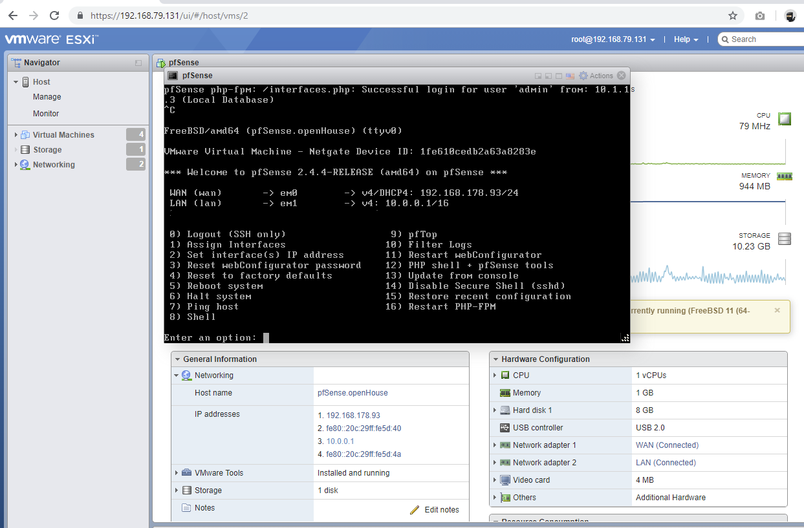

## Create pfSense Instance
First, we need pfSense, as this will defines who has what IP address and who can connect to whom and things like that. So start with creating a virtual instance of PFsense using the ISO you can [download](https://www.pfsense.org/download/) for free. Upload that ISO file ([not the zipped version!](https://www.7-zip.org/)) to the VMWare Server using the hypervisor's webinterface->Storage->Datastore browser->upload. Aftwards, use the webinterface to create the VM instance using the webinterface->Virtual Machines->Create/Reigster VM. The ISO file can be found [here](https://www.netgate.com/docs/pfsense/releases/versions-of-pfsense-and-freebsd.html) ). Ensure you have that ISO file from the datastore selected as CD-Drive and that the Network LAN is selected. I recommend to use the compatibility 5.0 so you can run this VM on any backup computer and way more dedicated hardware. You can always upgrade later (and downgrade).  My Instance is classified as FreeBSD Pre-11, has 1 CPU and 1GB Ram and 8GB HDD with 2 network adapters, the first is connected to WAN and one other connected to LAN. Hit Power up and go through that installation process.
Once pfSense started, use the 
- assign the (2)interfaces(wan and lan) with option "1". 
    - VLANs, no. 
    - WAN -> em0 (verify what Mac address is assigned to vSwitch WAN in the hypervisor web-interface->Network->VM Network)
    - LAN -> em1 (verify what Mac address is assigned to vSwitch WAN in the hypervisor web-interface->Network->LAN)
- set interface IPs
    - WAN, dhcp for IPv4 and none for IPv6. 
    - LAN, I use IP: 10.0.0.1/16, enable DHCP-server from range 10.0.10.1 to 10.0.19.254
- reboot
    - pfSense overview should show 
        - WAN with an IP address from your current home network, e.g. 192.168.178.200.
        - LAN with an IP address 10.0.0.1/16
        
- start the shell:
    - run command *pkg install pfSense-pkg-Open-VM-Tools* to install vmware tools.

### Autostart with Vmware Hypervisor
In the hypervisor's webinterface->Manage->Autostart, you can define that with the VMware Server, all instances will turn on automatically as well. Verify that they all start automatically when the host VM (esxi) starts. pfSense should boot first. 