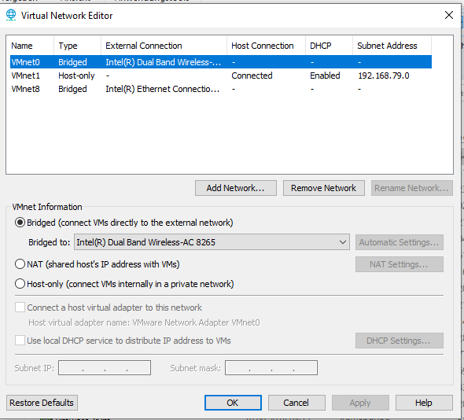

## Connect Router to the virtual LAN port
When you built the server on dedicated hardware, you probably have a physical ethernet port available. 
Adding components like a switch or a philips hue to your "virtual" server requires a little trick.
By Default, VMware will bridge "all" selected network hardware to one NIC. But in my case, I want one port (the one from my computer that has internet connection) passed to the vmware server (and to the WAN side of pfSense) and a different port (that has a switch connected to it with access point and philips hue etc) to pass to the vmware server (and to the LAN side of pfSense). 

 You need this tool to specify the exact network hardware you want to pass through to your virtual server. Without it, VMware would bridge them all together. Thanks to Tobias Hartmann, available here: [download](https://www.tobias-hartmann.net/2018/12/download-vmnetcfg-exe-fuer-vmware-workstation-15-x-player/) (run as administrator)

## Extend storage space on existing server
If your VM instance is running out of storage space: 
Link to Extend a virtual partition: https://www.thomas-krenn.com/de/wiki/LVM_vergr%C3%B6%C3%9Fern

## Move to Production
Ready for production? Check the subsection of OpenHab hardware on how to get your own dedicated VMWare Server, then just restore the backup'ed instances on that server and run them. 